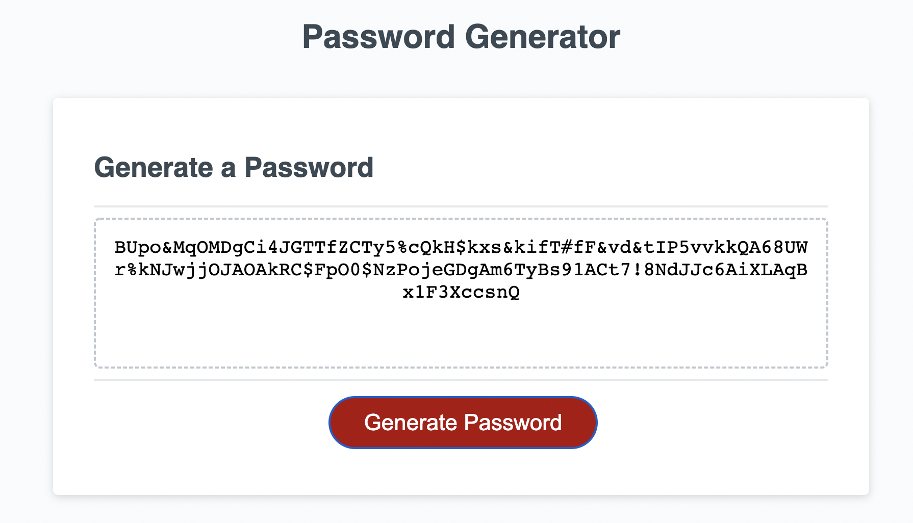

# JavaScript Password Generator
In this deployed responsive application you will find be able to generate a random password between 8 and 128 characters based on multiple criterias.

Link to the deployed application: https://richardguarnieri.github.io/password-generator/

## Criteria Selection List:
1. If the user wants to include uppercase characters
2. If the user wants to include lowercase characters
3. If the user wants to include digits
4. If the user wants to include symbols (special characters)

## Application Image

*Brief look at the page*